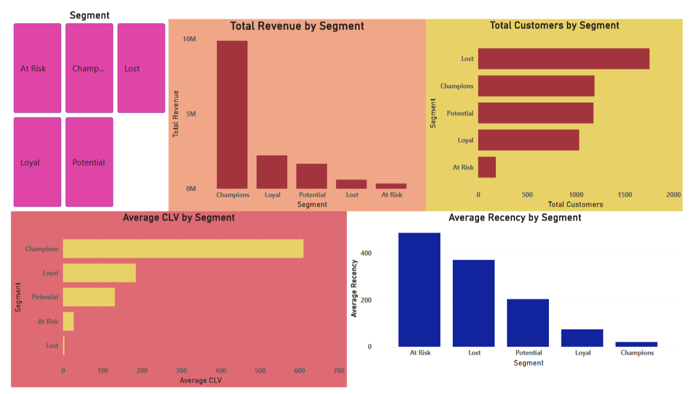
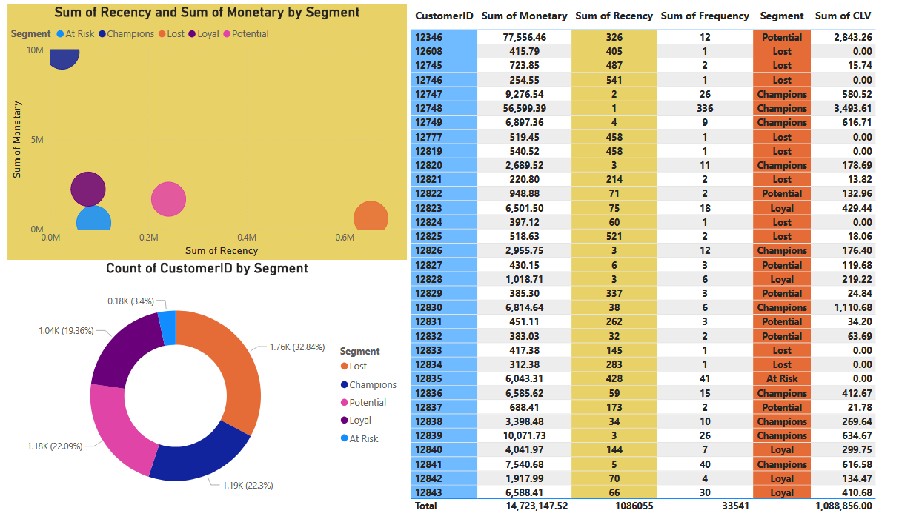
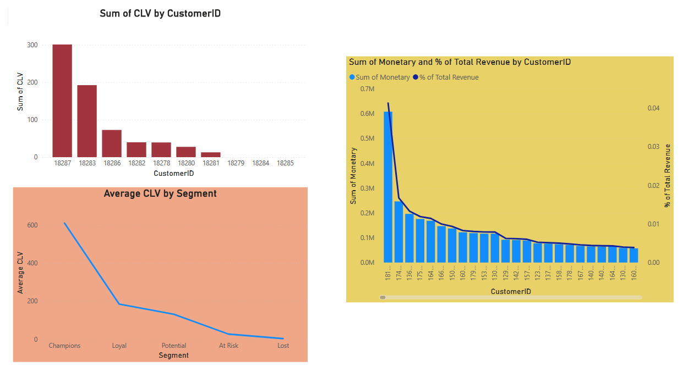

# 🛒 Customer Lifetime Value (CLV) & RFM Segmentation for E-Commerce

## 📌 Project Overview
This project builds an **intelligent Customer Lifecycle Management system** for an e-commerce business. Using 2 years of transaction data (1M+ rows) from a UK-based retailer, I segmented customers via **RFM analysis** and predicted their **future Lifetime Value (CLV)** using probabilistic models (BG/NBD & Gamma-Gamma).

## 🎯 Business Problem
How can a business allocate its marketing budget efficiently to maximize ROI? By identifying:
- Which customers are the most valuable (Champions).
- Who is about to churn (At Risk).
- Who is not worth pursuing (Lost).

## 🔧 Tools & Technologies
- **Python**: Pandas, NumPy, Lifetimes (BG/NBD, Gamma-Gamma)
- **Statistics**: Quantile-based RFM scoring, Pareto analysis
- **Visualization**: Power BI (Interactive Dashboard)
- **Economics**: NPV calculation, Pareto efficiency, retention vs acquisition cost analysis

## 📊 Key Insights
| Metric | Finding |
|--------|---------|
| **Pareto Rule** | Top 20% of customers generate **76%** of total revenue. |
| **Highest CLV** | Champions (Avg CLV = $611) vs Lost (Avg CLV = $3.76) – a **162x** difference. |
| **Retention Focus** | "At Risk" customers (182 users) have a CLV 7x higher than Lost – win-back campaigns here yield the highest ROI. |

## 🖥️ Power BI Dashboard

*The dashboard includes segment slicers, Pareto charts, and drill-down tables.*

## 🚀 How to Reproduce
1. Clone this repo.
2. Install dependencies: `pip install -r requirements.txt`.
3. **After cloning, downoad the [UCI Online Retail dataset](https://archive.ics.uci.edu/dataset/502/online+retail+ii) and place it in the main folder of repo.**
4. Run the Jupyter notebook.
5. Open the Power BI file to explore the dashboard using the excel file that python code creates

## 💡 Economic Interpretation
- **Resource Allocation**: 60% of the retention budget should be directed to Champions and At-Risk segments to maximize CLV under budget constraints.
- **Retention > Acquisition**: Re-engaging an "At Risk" customer ($10 incentive) yields a positive NPV ($27 CLV), whereas acquiring a "Lost" customer costs ~$120 for a $3.76 return – a clear negative ROI.

## 📁 Repository Structure
- project.ipynb
- ecommerce_dashboard.pbix
- rfm_clv_output.csv
- dashboard/screenshots
- requirements.txt
- README.md
